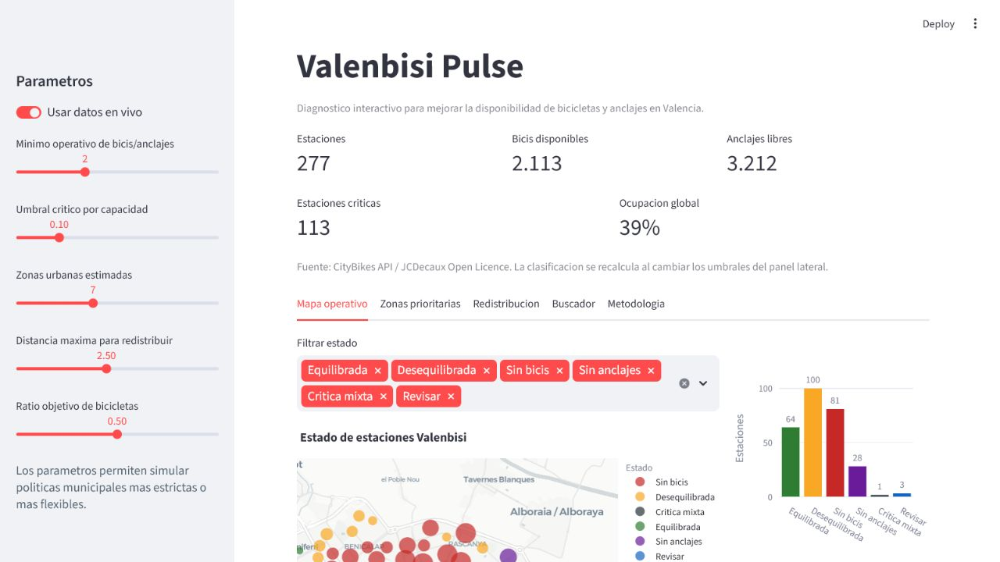

# Valenbisi Pulse

[](https://github.com/0227lia/valenbisi-pulse/actions/workflows/ci.yml)

Dashboard operativo para analizar la disponibilidad de bicicletas y anclajes de Valenbisi, detectar estaciones críticas y proponer movimientos de redistribución revisables.



## Problema

El total de bicicletas de una red no describe por sí solo la calidad del servicio. Una estación vacía impide iniciar un viaje y una estación llena impide devolver la bicicleta. La aplicación organiza la información de la red para responder:

1. ¿Qué estaciones necesitan atención ahora?
2. ¿Qué zonas concentran mayor desequilibrio?
3. ¿Qué traslados cortos podrían mejorar la disponibilidad?

## Tecnologías

- Python, pandas y NumPy para preparación y métricas.
- scikit-learn para clustering geoespacial reproducible.
- Streamlit y Plotly para la aplicación interactiva.
- pytest y Ruff para validación automática.
- GitHub Actions para integración continua.

## Flujo

```text
CityBikes API ─┐
               ├─> limpieza -> features -> estado y prioridad -> dashboard
muestra local ─┘                         ├─> clustering de zonas
                                        └─> plan de redistribución
```

La API abierta de CityBikes para `valenbisi` se usa como fuente principal. La muestra incluida en `data/` permite ejecutar la aplicación y los tests sin depender de la red.

## Instalación

```bash
python -m venv .venv
```

En Windows:

```powershell
.venv\Scripts\Activate.ps1
python -m pip install -r requirements.txt
```

En macOS o Linux:

```bash
source .venv/bin/activate
python -m pip install -r requirements.txt
```

## Ejecución

```bash
streamlit run app.py
```

La barra lateral permite cambiar umbrales operativos, número de zonas, distancia máxima y ratio objetivo. Los resultados se recalculan con cada configuración.

## Resultados reproducibles

Para generar un informe sobre la muestra local:

```bash
python scripts/generate_sample_report.py
```

Se crean:

- `reports/sample_snapshot.json`
- `reports/sample_zone_summary.csv`
- `reports/sample_rebalancing.csv`

Las cifras en vivo varían porque representan el estado de la red en el momento de la consulta.

Con los umbrales por defecto, la muestra reproducible incluida contiene 30 estaciones y 624 plazas. En esa muestra se detectan 21 estaciones críticas y se proponen 8 movimientos candidatos. Estas cifras sirven para validar el pipeline y no describen el estado actual de Valenbisi.

## Tests

```bash
python -m pip install -r requirements-dev.txt
ruff check .
pytest
```

## Estructura

```text
.
├── .github/workflows/ci.yml
├── app.py
├── data/sample_valenbisi.csv
├── docs/
├── reports/
├── scripts/generate_sample_report.py
├── src/valenbisi.py
└── tests/test_valenbisi.py
```

## Metodología y limitaciones

El score y la redistribución son heurísticas transparentes de apoyo al análisis. No estiman demanda futura ni sustituyen rutas operativas optimizadas. La metodología, supuestos y limitaciones están detallados en [docs/METHODOLOGY.md](docs/METHODOLOGY.md).

## Datos y licencia

- Fuente: [CityBikes API](https://api.citybik.es/v2/networks/valenbisi).
- Proveedor indicado por la API: JCDecaux Open Data.
- Código del proyecto: licencia MIT.

## Autor

Desarrollado por [0227lia](https://github.com/0227lia) como proyecto de portfolio de Ciencia de Datos.
