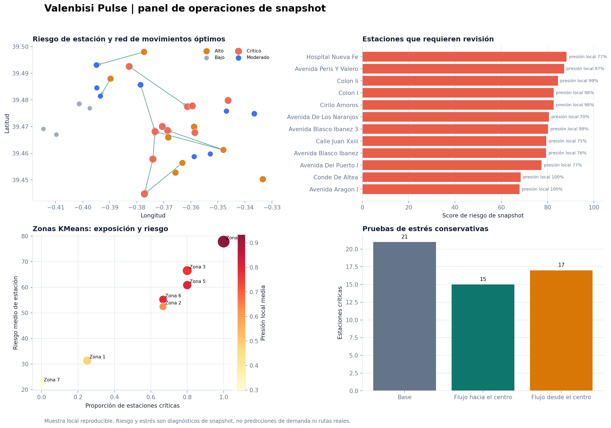
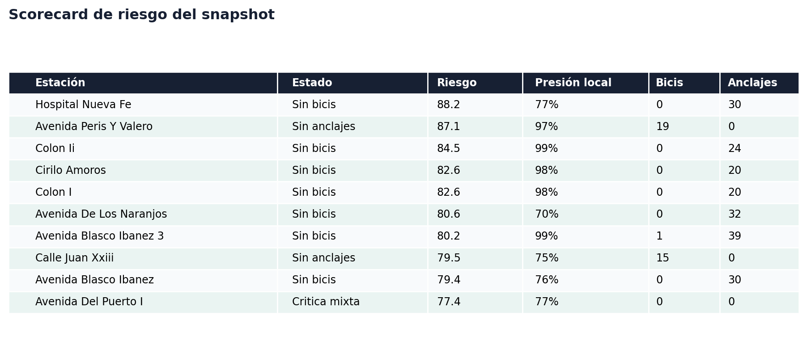

# Valenbisi Pulse

[](https://github.com/0227lia/valenbisi-pulse/actions/workflows/ci.yml)

Centro de control reproducible para analizar un snapshot de Valenbisi: calidad de datos, riesgo por estación y vecindario, redistribución de coste mínimo y pruebas de estrés conservativas.



## Problema

El total de bicicletas no describe por sí solo la calidad del servicio. Una estación vacía bloquea el inicio de viaje; una llena bloquea la devolución. El proyecto trabaja sobre un **snapshot**, no sobre un histórico, y responde:

1. ¿Qué estaciones requieren revisión inmediata y por qué?
2. ¿Qué zonas analíticas concentran riesgo operativo y presión local?
3. ¿Qué movimientos de bicicletas cubren más déficit dentro de una distancia máxima explícita?
4. ¿Cómo cambia el equilibrio si se simula un flujo entre periferia y centro?

No presenta predicciones de demanda ni rutas operativas reales. Cada salida documenta ese límite.

## Resultados de la muestra reproducible

Estos valores se generan desde `data/sample_valenbisi.csv`; no representan el estado actual de la red:

- 30 estaciones, 624 plazas declaradas y 226 bicicletas disponibles.
- 21 estaciones críticas con los umbrales base de la muestra.
- 7 orígenes y 14 destinos elegibles para redistribución; 49 arcos quedan dentro de 2,5 km.
- El solver de transporte mínimo asigna 53 de 152 bicicletas de necesidad modelada (34,9%) con 91,28 bici-km de distancia geodésica acumulada.
- Las dos pruebas de estrés conservan bicicletas dentro de la red y se etiquetan como simulación, no como pronóstico.



## Arquitectura

```text
CityBikes API o muestra versionada
            |
Limpieza, consistencia y controles de calidad
            |
Clasificación de estado + riesgo local k-NN
            |
KMeans de zonas analíticas + diagnóstico de exposición
            |
LP de transporte con necesidad no cubierta penalizada
            |
Escenarios conservativos centro <-> periferia
            |
Dashboard Streamlit, CSV, JSON y figuras reproducibles
```

## Métodos

| Componente | Implementación | Salida |
|---|---|---|
| Calidad | Duplicados, coordenadas, capacidad, inventario y operación | Tabla de controles auditables. |
| Riesgo | Estado actual, desequilibrio, presión k-NN e aislamiento | Score de snapshot de 0 a 100. |
| Zonas | `KMeans` reproducible sobre coordenadas locales | Riesgo y proporción crítica agregados. |
| Redistribución | Problema lineal de transporte con `scipy.optimize.linprog` | Plan de coste mínimo y necesidad no cubierta. |
| Estrés | Flujo determinista que conserva bicicletas | Cambio de estados bajo escenarios declarados. |

La [metodología](docs/METHODOLOGY.md) incluye fórmulas, restricciones y límites; la [tarjeta de decisión](docs/DECISION_MODEL.md) delimita el uso correcto.

## Dashboard interactivo

```bash
streamlit run app.py
```

El panel comienza con la muestra local para que sea reproducible. Se puede activar la consulta de CityBikes desde la barra lateral; los resultados de una consulta en vivo son volátiles y no se guardan en el repositorio.

## Instalación

```bash
python -m venv .venv
```

En Windows:

```powershell
.venv\Scripts\Activate.ps1
python -m pip install -r requirements-dev.txt
```

En macOS o Linux:

```bash
source .venv/bin/activate
python -m pip install -r requirements-dev.txt
```

## Reconstrucción y validación

```bash
python -m ruff check .
python -m pytest
python scripts/generate_sample_report.py
streamlit run app.py
```

La acción de GitHub ejecuta lint, tests, importación del dashboard y reconstrucción de todos los artefactos de muestra.

## Salidas principales

| Archivo | Contenido |
|---|---|
| `reports/sample_snapshot.json` | Métricas del snapshot y resumen del solver. |
| `reports/sample_station_risk.csv` | Snapshot enriquecido con riesgo, vecindario y zonas. |
| `reports/sample_quality_checks.csv` | Controles de calidad del snapshot. |
| `reports/sample_zone_summary.csv` | Diagnóstico agregado por zona KMeans. |
| `reports/sample_rebalancing.csv` | Plan de transporte de coste mínimo. |
| `reports/sample_rebalancing_greedy.csv` | Referencia de la heurística greedy original. |
| `reports/sample_stress_scenarios.csv` | Resultados de pruebas de estrés deterministas. |
| `reports/figures/operations_decision_dashboard.png` | Panel estático de revisión rápida. |

## Datos y privacidad

- Fuente en vivo: [CityBikes API para Valenbisi](https://api.citybik.es/v2/networks/valenbisi).
- La API identifica a JCDecaux como proveedor de la red.
- La muestra local se incluye solo para reproducibilidad y no contiene datos personales.

Consulta [data/README.md](data/README.md) antes de reutilizar snapshots o afirmar que describen el estado actual de la red.

## Limitaciones

- Un snapshot no permite aprender patrones temporales ni predecir demanda.
- Las distancias son geodésicas; no son rutas de vehículo ni tiempos de viaje.
- El LP no incluye capacidad de furgonetas, turnos, tráfico, costes ni restricciones de calle.
- KMeans agrupa posiciones para el análisis, no representa barrios administrativos.
- Las pruebas de estrés conservan stock mediante reglas explícitas, pero no son una simulación de usuarios reales.

## Autor

Proyecto de portfolio de Ciencia de Datos desarrollado por [0227lia](https://github.com/0227lia). Código bajo licencia MIT; los datos conservan las condiciones de sus fuentes.
